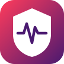
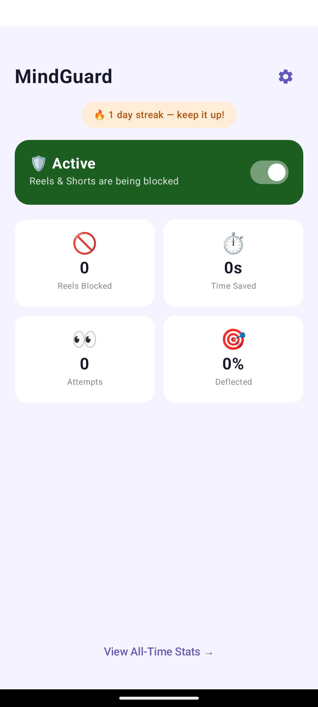
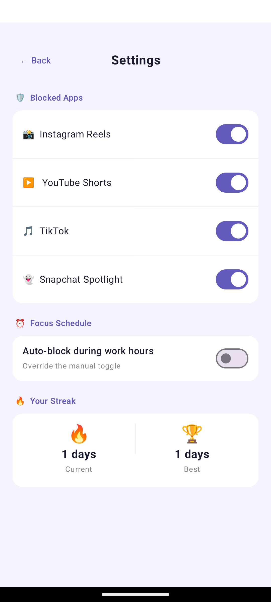
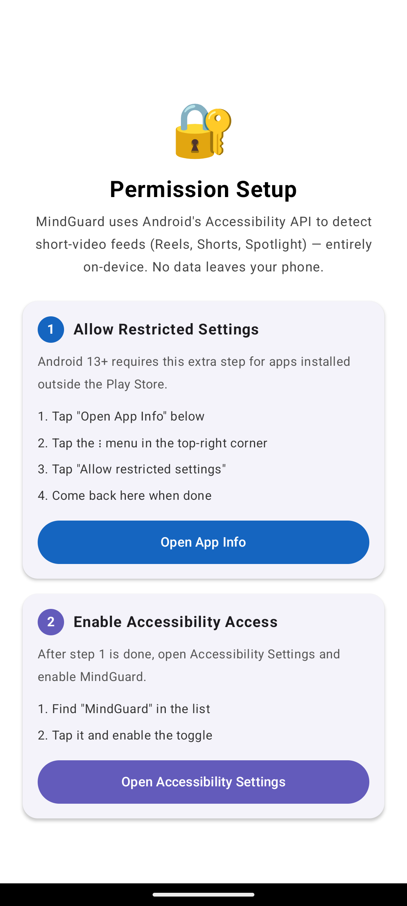

#  MindGuard

**Reclaim your attention. Block Instagram Reels, YouTube Shorts, TikTok, and Snapchat Spotlight — entirely on your phone.**

MindGuard is a privacy-first Android app that detects and blocks short-form video feeds before you get sucked in. No accounts. No tracking. No servers. Just you, your focus, and 500ms of protection.

---

## The Problem

You pick up your phone for one thing. Instagram for 5 minutes. YouTube to find a tutorial. TikTok just to check. Snapchat for your streak.

Three hours later, you're still scrolling. You lost the afternoon. Again.

MindGuard stops this. Instantly.

---

## How It Works

When you open Instagram and navigate to Reels, MindGuard **detects the exact moment the short-video player loads** and hits back before you can get hooked. Same with YouTube Shorts, TikTok, and Snapchat Spotlight.

All of this happens:
- **On your phone** — no internet needed
- **In 500ms** — faster than you can react
- **With zero data collection** — your choices stay yours

---

## What You Get

### Home Screen — Status at a Glance

See if blocking is active and track your progress in real-time.

<div align="center">
  
</div>

- **Active Shield** — blocks are running, Reels & Shorts can't get you
- **Reels Blocked** — how many times the app saved you today
- **Time Saved** — estimated hours you didn't lose
- **Attempts** — how many times you *wanted* a short-form feed
- **Deflected** — your success rate (blocks / attempts)
- **Streak** — current clean days + your personal best

### Settings — Fine-Grained Control

Decide which apps to block and when.

<div align="center">
  
</div>

**Per-App Toggles**
- Instagram Reels
- YouTube Shorts
- TikTok
- Snapchat Spotlight

**Focus Schedule**
- Auto-block during work hours (or custom times)
- Pause manually anytime
- 30-second pause button in notification shade

**Streak Tracking**
- See your current streak and personal best
- Built-in motivation to keep the streak alive

### Setup — Two Steps (Android 13+)

<div align="center">
  
</div>

1. **Allow Restricted Settings** (one-time, Android 13+ only)
2. **Enable MindGuard Accessibility Service**

That's it. Blocking starts immediately.

---

## Under the Hood

MindGuard uses Android's **Accessibility API** to read screen layout in real-time. It watches for specific resource IDs that indicate the short-video player is on screen, then instantly navigates away.

```
User opens Instagram Reels
           ↓
AccessibilityService detects 'reel_pager' resource ID
           ↓
RuleEngine evaluates: "Is this a Reels player?"
           ↓
Decision: YES → Block
           ↓
BlockActionExecutor clicks Home tab (stay in Instagram)
           ↓
User sees Home feed instead of Reels
           ↓
MindGuard logs: +1 block, +1 attempt
```

### Why Resource IDs?

MindGuard doesn't read text or analyze navigation buttons. It uses **resource IDs only** — internal view IDs that identify the exact component.

This means:
- Opening Instagram doesn't trigger a block (just the app icon shows, no Reels player)
- Opening YouTube doesn't trigger a block (Shorts nav tab visible, but player not loaded)
- **Only the confirmed player-specific layout triggers a block**

### Detection Accuracy

Each app's short-form player has its own set of signature resource IDs:

| App | Blocked Player IDs |
|---|---|
| **Instagram** | `clips_viewer_view_pager`, `reel_pager`, `reel_play_button`, `reels_viewer` |
| **YouTube** | `reel_watch_fragment_root`, `reel_progress_bar`, `shorts_container` |
| **TikTok** | TikTok video-feed container IDs |
| **Snapchat** | `spotlight_container` |

Instagram's home feed, Explore, and Messaging **are never blocked** — the service has an explicit guard that short-circuits detection for feed screens.

---

## Architecture

```
mindguard/
├── shared/                  ← Pure Kotlin (no Android deps)
│   └── commonTest/
│       ├── rules/           RuleEngine, InstagramReelRule, YouTubeShortsRule, ...
│       ├── models/          ScreenSnapshot, DetectionResult, BlockAction
│       └── usecases/        FocusPauseLogic, BlockCooldown, DetectBlockedContentUseCase
│
└── androidApp/              ← Android layer
    ├── accessibility/       MindGuardAccessibilityService, BlockActionExecutor
    ├── storage/             SettingsDataStore (DataStore Preferences)
    ├── ui/                  Compose screens: Home, Settings, Stats, Onboarding
    └── di/                  Koin dependency injection
```

The shared module is **100% testable on the JVM** — zero Android dependencies. All detection logic, rules, and decision-making run as unit tests before any Android code touches them.

---

## Installation

### From GitHub Releases

Download the APK from the [latest release](https://github.com/Ashish-CodeJourney/MindGuard/releases) and install it.

### From Source

```bash
git clone https://github.com/Ashish-CodeJourney/MindGuard.git
cd MindGuard
./gradlew :androidApp:assembleDebug
# APK at: androidApp/build/outputs/apk/debug/app-debug.apk
```

### Android 13+ Setup

After installing a sideloaded APK:

1. Go to **Settings → Apps → MindGuard**
2. Tap ⋮ → **Allow restricted settings**
3. Go to **Settings → Accessibility → MindGuard** → enable

### Quick Settings Tile (Optional)

Long-press your notification shade → **Edit tiles** → drag **Focus Mode** into active tiles. Now you can pause blocking with one tap.

---

## Privacy

- ✅ **On-device only** — all detection runs locally
- ✅ **No accounts** — nothing to sign up for
- ✅ **No tracking** — no analytics, no user profiling
- ✅ **No internet** — zero network requests
- ✅ **Accessibility scope limited** — service can only read from 4 apps (Instagram, YouTube, TikTok, Snapchat)
- ✅ **Explicit consent** — you enable it manually in system settings

Read the full [accessibility declaration](https://github.com/Ashish-CodeJourney/MindGuard/blob/main/androidApp/src/main/AndroidManifest.xml#L45-L60).

---

## Development

### Running Tests

```bash
./gradlew :shared:testDebugUnitTest
```

All business logic is **test-first** (TDD). Tests live in `shared/src/commonTest/` and run on the JVM.

### Tech Stack

- **Language** — Kotlin Multiplatform (shared logic + Android UI)
- **UI** — Jetpack Compose + Material 3
- **Async** — Coroutines + Flow
- **Storage** — DataStore Preferences
- **DI** — Koin
- **Testing** — Kotlin Test

### Adding a New Blocking Rule

1. Create a new `BlockingRule` in the shared module:

```kotlin
class BeRealRule : BlockingRule {
    override fun evaluate(snapshot: ScreenSnapshot): DetectionResult {
        if (snapshot.packageName != "com.bereal.app") return noBlock()
        
        return if (snapshot.resourceIds.any { it.contains("camera_view") })
            DetectionResult(shouldBlock = true, action = BlockAction.GO_BACK, reason = "BeReal camera detected")
        else noBlock()
    }
}
```

2. Register in `MindGuardAccessibilityService`:

```kotlin
RuleEngine(listOf(
    InstagramReelRule(), YouTubeShortsRule(), TikTokRule(), 
    SnapchatSpotlightRule(), BeRealRule()  // add here
))
```

3. Add the package name to:
   - `androidApp/src/main/res/xml/accessibility_config.xml` (service scope)
   - `SettingsDataStore` (user toggles)

---

## Requirements

- **Android 7.0+** (API 24+)
- **Accessibility Service permission** (granted in system settings)

---

## License

MIT — see [LICENSE](LICENSE)

---

## Questions?

- 🐛 Found a bug? [Issues](https://github.com/Ashish-CodeJourney/MindGuard/issues)
- 🤝 Want to contribute? PRs welcome!
